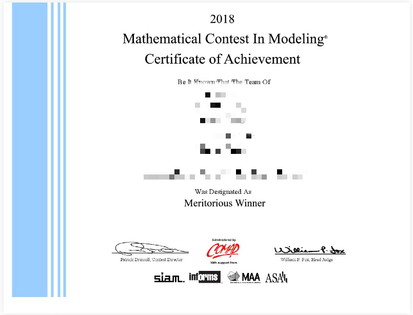

# MATLAB_Algorithm_with_cases
遗传算法、免疫算法、退火算法、粒子群算法、鱼群算法、蚁群算法和神经网络算法等常用智能算法的MATLAB实现

# Introduction

在数学建模竞赛期间学习的各类智能算法，之前放在CSDN上，标了1积分的辛苦分，但是在下载人数多了以后自动给我涨分，多的甚至高达50分/次，个人感觉不利于建模者学习，故此在将之前的代码改回1积分的同时也转移到Github上。主要包括遗传算法、免疫算法、退火算法、粒子群算法、鱼群算法、蚁群算法和神经网络算法等常用智能算法的MATLAB实现，部分代码有案例，方便对于算法的学习与应用。

如果觉得还可以的话就给我颗star吧~

2018年MCM/ICM美赛B题M奖

